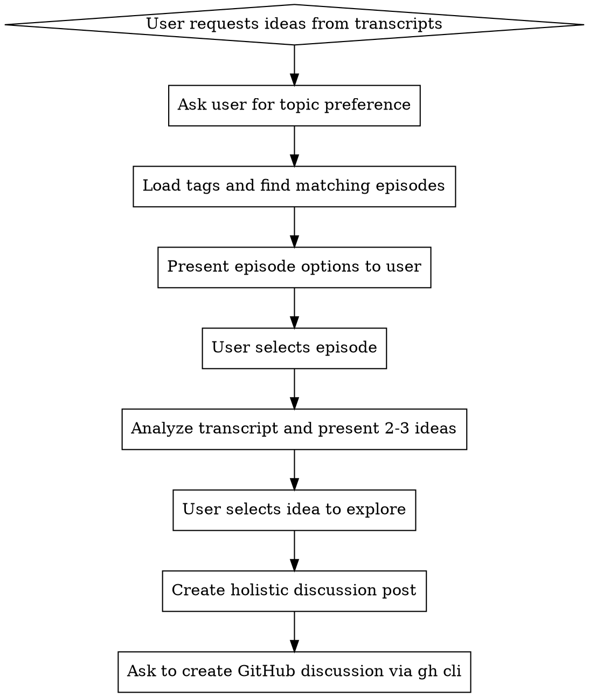

# Generate Episode Ideas

## Overview

Transforms Ngobrolin WEB podcast transcripts into actionable discussion ideas for GitHub conversations. This skill extracts insights from tagged episodes and structures them for community engagement.

## When to Use

User asks to:
- Generate ideas from transcripts/episodes
- Create discussion topics from podcast content
- Explore topics covered in episodes
- Find inspiration for GitHub discussions

**Do NOT use for:**
- General transcript analysis without idea generation
- Summarizing episodes without discussion intent
- Searching transcripts (use Grep/Read instead)

## Core Pattern



## Quick Reference

| Step | Action | Tool/Command |
|------|--------|--------------|
| 1 | Ask user for topic | AskUserQuestion |
| 2 | Find matching episodes | Read src/data/tags.json |
| 3 | Get transcript | Read src/data/transcripts/{videoId}.json |
| 4 | Present ideas | Analyze segments |
| 5 | Create discussion | gh discussion create |

## Implementation

### Step 1: Ask for Topic Preference

First, load available tags and ask the user to select:

```bash
# Read tags.json to get available topics
cat /Users/ivan/Works/AI/ngobrolinweb/landing.worktrees/develop-project-skills/src/data/tags.json
```

Use AskUserQuestion with available tags as options (ai, testing, css, javascript, typescript, etc.)

### Step 2: Find Matching Episodes

From tags.json, find videoIds that match the selected topic. Cross-reference with episodes.json for titles.

Example response to user:
```
Found 3 episodes about "ai":
1. Agentic Coding Tools (Tkh8-LleLws)
2. Agentic AI (ZcYNuHirHOA)
3. Ngobrolin Gemini 3 (lPTtyv8Hzgs)

Which episode would you like to explore?
```

### Step 3: Analyze Transcript

Read the transcript file and identify key themes, insights, and quotable moments.

Look for:
- Contrarian viewpoints or surprising insights
- Practical challenges mentioned
- Evolving opinions or "a-ha" moments
- Specific tool/technology discussions
- Personal experiences shared

### Step 4: Present 2-3 Ideas

Present ideas concisely with:
- **Idea Title**: Clear, engaging headline
- **Key Insight**: What makes this interesting
- **Discussion Question**: Specific question to prompt engagement

Ask user which idea to explore further.

### Step 5: Create Holistic Discussion

Expand selected idea into:
- **Catchy Title**: Emoji + compelling question
- **Context**: Brief podcast reference
- **Main Question**: Clear discussion prompt
- **Discussion Points**: 3-4 specific angles
- **Call to Action**: Invite community participation

### Step 6: Create GitHub Discussion/Issue (Optional)

Use gh CLI to create a discussion or issue:

```bash
# For Discussions (if enabled)
gh discussion create --repo ngobrolin/landing --title "TITLE" --body "BODY"

# For Issues
gh issue create --repo ngobrolin/landing --title "TITLE" --body "BODY"
```

Ask user confirmation before creating. Use issues if discussions are not enabled.

## Common Mistakes

| Mistake | Fix |
|---------|-----|
| Skipping user topic selection | Always ask first with AskUserQuestion |
| Analyzing without episode context | Present episode options before deep dive |
| Too many ideas | Limit to 2-3, focus on quality |
| Generic discussion questions | Make them specific and actionable |
| Creating GitHub post without permission | Always ask before gh cli execution |

## Red Flags - STOP and Re-read Skill

- Presenting analysis without asking user preference first
- Generating more than 3 ideas at once
- Creating GitHub discussion without explicit user confirmation
- Skipping the episode selection step
- Using vague, generic discussion prompts

**All of these mean: Re-read the skill and follow the workflow exactly.**

## Example Output Format

After transcript analysis, present ideas like:

```
Based on "Agentic Coding Tools" episode, here are 3 discussion ideas:

1. 🤖 The "AI Burnout" Paradox
   Key insight: Tools meant to increase productivity are causing longer hours
   Discussion: How do you set healthy boundaries with AI tools?

2. 🏗️ Infrastructure for Agentic AI
   Key insight: VPS vs local development for AI tooling
   Discussion: What's your setup - local, VPS, or cloud?

3. 🔄 From Assistants to Agents
   Key insight: Delegating coding vs maintaining control
   Discussion: Where do you draw the line with agentic workflows?

Which idea would you like to explore further?
```
